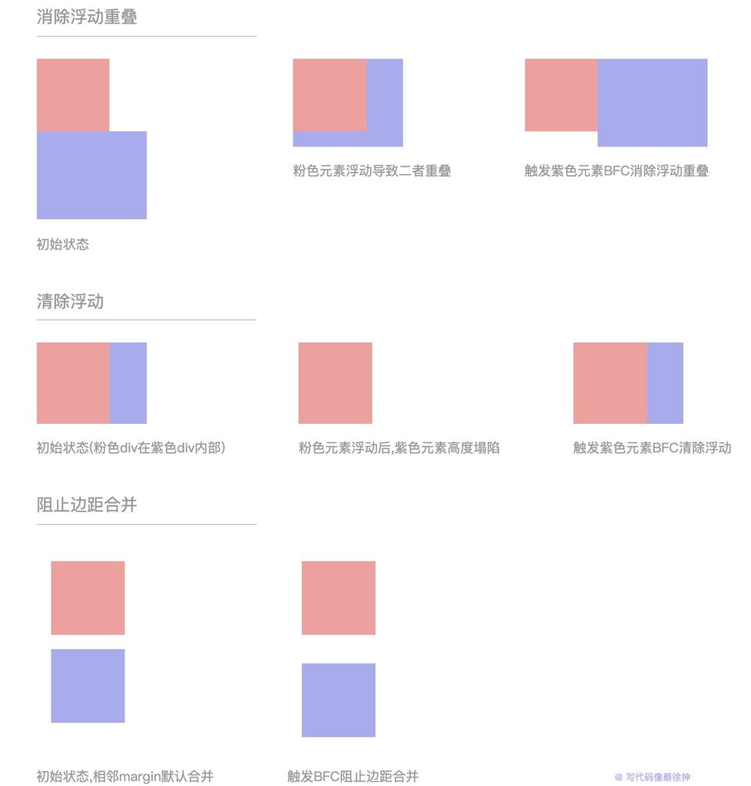

### (1)清除浮动的方法
+ 为什么要清除浮动：清除浮动是为了解决子元素浮动而导致父元素高度塌陷的问题

1. 添加新元素
\

  \

  \<!-- 添加一个空元素，利用css提供的clear:both清除浮动 -->
  \

\
  

2. 使用伪元素
<pre>
/* 对父元素添加伪元素 */
.parent::after{
  content: "";
  display: block;
  height: 0;
  clear:both;
}
</pre>
3. 触发父元素BFC
<pre>
/* 触发父元素BFC */
.parent {
  overflow: hidden;
  /* float: left; */
  /* position: absolute; */
  /* display: inline-block */
  /* 以上属性均可触发BFC */
}

</pre>
### (2)什么是BFC
+ BFC全称 Block Formatting Context 即块级格式上下文，简单的说，BFC是页面上的一个隔离的独立容器，不受外界干扰或干扰外界
### (3)如何触发BFC
1. float不为 none
2. overflow的值不为 visible
3. position 为 absolute 或 fixed
4. display的值为 inline-block 或 table-cell 或 table-caption 或 grid

### (4)BFC的渲染规则是什么
1. BFC是页面上的一个隔离的独立容器，不受外界干扰或干扰外界
2. 计算BFC的高度时，浮动子元素也参与计算（即内部有浮动元素时也不会发生高度塌陷）
3. BFC的区域不会与float的元素区域重叠
4. BFC内部的元素会在垂直方向上放置
5. BFC内部两个相邻元素的margin会发生重叠

### (5)BFC的应用场景
1. 清除浮动：BFC内部的浮动元素会参与高度计算，因此可用于清除浮动，防止高度塌陷
2. 避免某元素被浮动元素覆盖：BFC的区域不会与浮动元素的区域重叠
3. 阻止外边距重叠：属于同一个BFC的两个相邻Box的margin会发生折叠，不同BFC不会发生折叠

