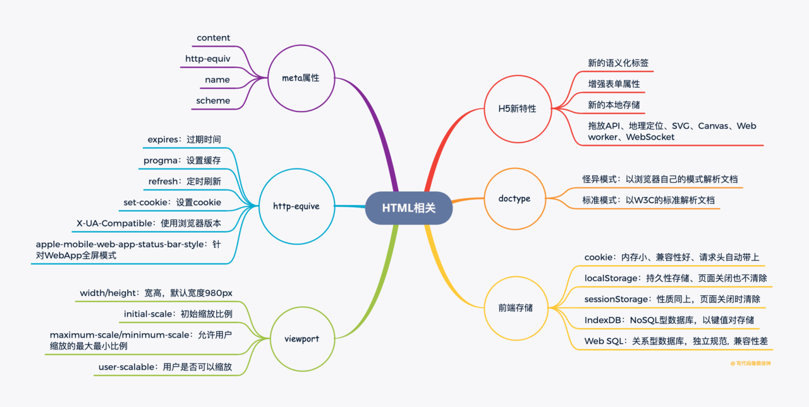

### (1)说说HTML5在标签、属性、存储、API上的新特性
1. 标签：新增语义化标签（aside / figure / section / header / footer / nav等），增加多媒体标签video和audio，使得样式和结构更加分离
2. 属性：增强表单，主要是增强了input的type属性；meta增加charset以设置字符集；script增加async以异步加载脚本
3. 存储：增加localStorage、sessionStorage和indexedDB，引入了application cache对web和应用进行缓存
4. API：增加拖放API、地理定位、SVG绘图、canvas绘图、Web Worker、WebSocket

### (2)doctype的作用是什么？
声明文档类型，告知浏览器用什么文档标准解析这个文档：
+ 怪异模式：浏览器使用自己的模式解析文档，不加doctype时默认为怪异模式
+ 标准模式：浏览器以W3C的标准解析文档

### (3)几种前端储存以及它们之间的区别
1. cookies： HTML5之前本地储存的主要方式，大小只有4k，HTTP请求头会自动带上cookie，兼容性好
2. localStorage：HTML5新特性，持久性存储，即使页面关闭也不会被清除，以键值对的方式存储，大小为5M
3. sessionStorage：HTML5新特性，操作及大小同localStorage，和localStorage的区别在于sessionStorage在选项卡(页面)被关闭时即清除，且不同选项卡之间的sessionStorage不互通
4. IndexedDB： NoSQL型数据库，类比MongoDB，使用键值对进行储存，异步操作数据库，支持事务，储存空间可以在250MB以上，但是IndexedDB受同源策略限制
5. Web SQL：是在浏览器上模拟的关系型数据库，开发者可以通过SQL语句来操作Web SQL，是HTML5以外一套独立的规范，兼容性差

### (4)href和src有什么区别
1. href（hyperReference）即超文本引用：当浏览器遇到href时，会并行的地下载资源，不会阻塞页面解析，例如我们使用\<link>引入CSS，浏览器会并行地下载CSS而不阻塞页面解析. 因此我们在引入CSS时建议使用\<link>而不是@import
\<link href="style.css" rel="stylesheet" />
2. src（resource）即资源，当浏览器遇到src时，会暂停页面解析，直到该资源下载或执行完毕，这也是script标签之所以放底部的原因
\

### (5)meta有哪些属性，作用是什么
+ meta标签用于描述网页的元信息，如网站作者、描述、关键词，meta通过name=xxx和content=xxx的形式来定义信息，常用设置如下：
1. charset：定义HTML文档的字符集
\<meta charset="UTF-8" >
2. http-equiv：可用于模拟http请求头，可设置过期时间、缓存、刷新
\<meta http-equiv="expires" content="Wed, 20 Jun 2019 22:33:00 GMT">
3. viewport：视口，用于控制页面宽高及缩放比例
\<meta name="viewport" content="width=device-width, initial-scale=1, maximum-scale=1">

### (6)viewport有哪些参数，作用是什么
1. width/height，宽高，默认宽度980px
2. initial-scale，初始缩放比例，1~10
3. maximum-scale/minimum-scale，允许用户缩放的最大/小比例
4. user-scalable，用户是否可以缩放 (yes/no)

### (7)http-equive属性的作用和参数
1. expires，指定过期时间
2. progma，设置no-cache可以禁止缓存
3. refresh，定时刷新
4. set-cookie，可以设置cookie
5. X-UA-Compatible，使用浏览器版本
6. apple-mobile-web-app-status-bar-style，针对WebApp全屏模式，隐藏状态栏/设置状态栏颜色

