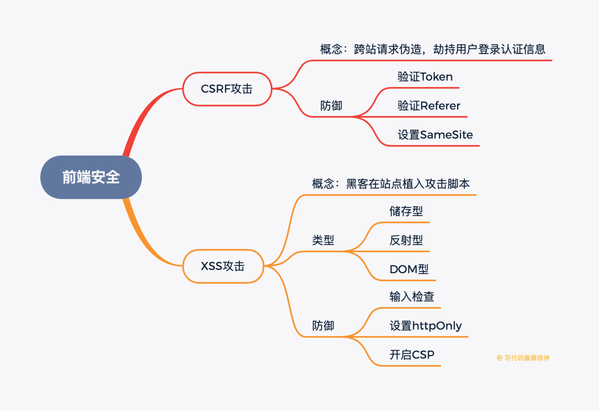

### 什么是CSRF攻击
+ CSRF即Cross-site request forgery(跨站请求伪造)，是一种挟制用户在当前已登录的Web应用程序上执行非本意的操作的攻击方法。
+ 假如黑客在自己的站点上放置了其他网站的外链，例如"www.weibo.com/api，默认情况下，浏览器会带着weibo.com的cookie访问这个网址，如果用户已登录过该网站且网站没有对CSRF攻击进行防御，那么服务器就会认为是用户本人在调用此接口并执行相关操作，致使账号被劫持。

### 如何防御CSRF攻击
1. 验证Token：浏览器请求服务器时，服务器返回一个token，每个请求都需要同时带上token和cookie才会被认为是合法请求
2. 验证Referer：通过验证请求头的Referer来验证来源站点，但请求头很容易伪造
3. 设置SameSite：设置cookie的SameSite，可以让cookie不随跨域请求发出，但浏览器兼容不一

### 什么是XSS攻击
+ XSS即Cross Site Scripting（跨站脚本），指的是通过利用网页开发时留下的漏洞，注入恶意指令代码到网页，使用户加载并执行攻击者恶意制造的网页程序。常见的例如在评论区植入JS代码，用户进入评论页时代码被执行，造成页面被植入广告、账号信息被窃取

### XSS攻击有哪些类型
1. 存储型：即攻击被存储在服务端，常见的是在评论区插入攻击脚本，如果脚本被储存到服务端，那么所有看见对应评论的用户都会受到攻击。
2. 反射型：攻击者将脚本混在URL里，服务端接收到URL将恶意代码当做参数取出并拼接在HTML里返回，浏览器解析此HTML后即执行恶意代码
3. DOM型：将攻击脚本写在URL中，诱导用户点击该URL，如果URL被解析，那么攻击脚本就会被运行。和前两者的差别主要在于DOM型攻击不经过服务端

### 如何防御XSS攻击
1. 输入检查：对输入内容中的\<script>\<iframe>等标签进行转义或者过滤
2. 设置httpOnly：很多XSS攻击目标都是窃取用户cookie伪造身份认证，设置此属性可防止JS获取cookie
3. 开启CSP，即开启白名单，可阻止白名单以外的资源加载和运行

