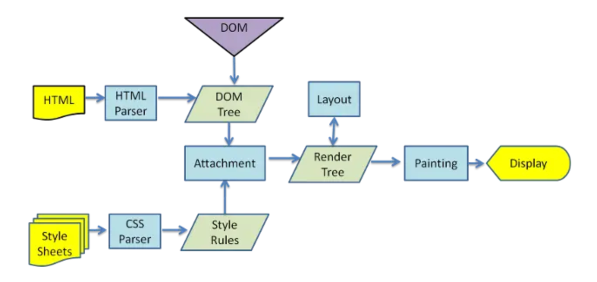
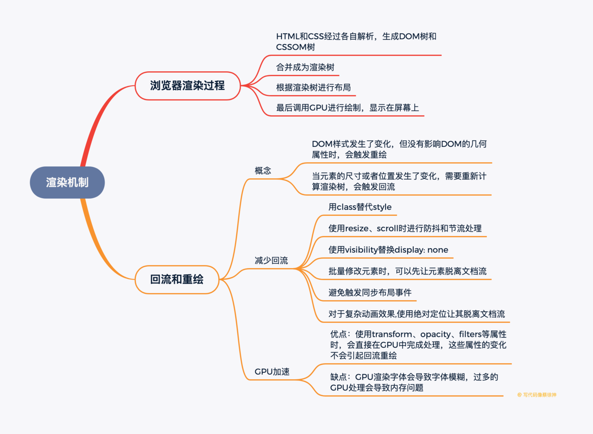

### (1)浏览器的渲染过程是怎样的

+ 大体流程如下：
1. HTML和CSS经过各自解析，生成DOM树和CSSOM树
2. 合并成为渲染树
3. 根据渲染树进行布局
4. 最后调用GPU进行绘制，显示在屏幕上

### (2)如何根据浏览器渲染机制加快首屏速度
1. 优化文件大小：HTML和CSS的加载和解析都会阻塞渲染树的生成，从而影响首屏展示速度，因此我们可以通过优化文件大小、减少CSS文件层级的方法来加快首屏速度
2. 避免资源下载阻塞文档解析：浏览器解析到\<script>标签时，会阻塞文档解析，直到脚本执行完成，因此我们通常把\<script>标签放在底部，或者加上defer、async来进行异步下载

### (3)什么是回流(重排)，什么情况下会触发回流
1. 当元素的尺寸或者位置发生了变化，就需要重新计算渲染树，这就是回流
2. DOM元素的几何属性(width/height/padding/margin/border)发生变化时会触发回流
3. DOM元素移动或增加会触发回流
4. 读写offset/scroll/client等属性时会触发回流
5. 调用window.getComputedStyle会触发回流

### (4)什么是重绘，什么情况下会触发重绘
+ DOM样式发生了变化，但没有影响DOM的几何属性时，会触发重绘，而不会触发回流。重绘由于DOM位置信息不需要更新，省去了布局过程，因而性能上优于回流
### (5)什么是GPU加速，如何使用GPU加速，GPU加速的缺点
1. 优点：使用transform、opacity、filters等属性时，会直接在GPU中完成处理，这些属性的变化不会引起回流重绘
2. 缺点：GPU渲染字体会导致字体模糊，过多的GPU处理会导致内存问题
### (6)如何减少回流
1. 使用class替代style，减少style的使用
2. 使用resize、scroll时进行防抖和节流处理，这两者会直接导致回流
3. 使用visibility替换display: none，因为前者只会引起重绘，后者会引发回流
4. 批量修改元素时，可以先让元素脱离文档流，等修改完毕后，再放入文档流
5. 避免触发同步布局事件，我们在获取offsetWidth这类属性的值时，可以使用变量将查询结果存起来，避免多次查询，每次对offset/scroll/client等属性进行查询时都会触发回流
6. 对于复杂动画效果,使用绝对定位让其脱离文档流，复杂的动画效果会频繁地触发回流重绘，我们可以将动画元素设置绝对定位从而脱离文档流避免反复回流重绘。

