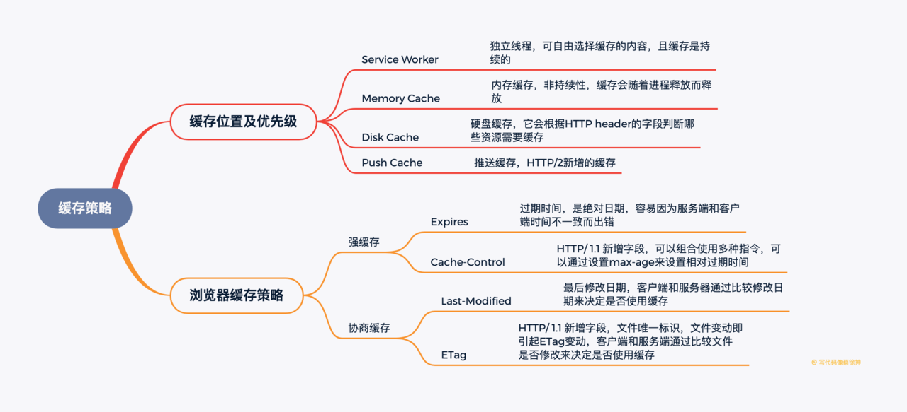

### (1)介绍一下浏览器缓存位置和优先级
1. Service Worker
2. Memory Cache（内存缓存）
3. Disk Cache（硬盘缓存）
4. Push Cache（推送缓存）
以上缓存都没命中就会进行网络请求
### (2)说说不同缓存间的差别
1. Service Worker
+ 和Web Worker类似，是独立的线程，我们可以在这个线程中缓存文件，在主线程需要的时候读取这里的文件，Service Worker使我们可以自由选择缓存哪些文件以及文件的匹配、读取规则，并且缓存是持续性的
2. Memory Cache（内存缓存）
+ 即内存缓存，内存缓存不是持续性的，缓存会随着进程释放而释放
3. Disk Cache（硬盘缓存）
+ 即硬盘缓存，相较于内存缓存，硬盘缓存的持续性和容量更优，它会根据HTTP header的字段判断哪些资源需要缓存
4. Push Cache（推送缓存）
+ 即推送缓存，是HTTP/2的内容，目前应用较少
### (3)介绍一下浏览器缓存策略
##### 强缓存(不要向服务器询问的缓存)
1. 设置Expires,即过期时间，例如「Expires: Thu, 26 Dec 2019 10:30:42 GMT」表示缓存会在这个时间后失效，这个过期日期是绝对日期，如果修改了本地日期，或者本地日期与服务器日期不一致，那么将导致缓存过期时间错误。
2. 设置Cache-Control,HTTP/1.1新增字段，Cache-Control可以通过max-age字段来设置过期时间，例如「Cache-Control:max-age=3600」除此之外Cache-Control还能设置private/no-cache等多种字段
##### 协商缓存(需要向服务器询问缓存是否已经过期)
1. Last-Modified,即最后修改时间，浏览器第一次请求资源时，服务器会在响应头上加上Last-Modified ，当浏览器再次请求该资源时，浏览器会在请求头中带上If-Modified-Since 字段，字段的值就是之前服务器返回的最后修改时间，服务器对比这两个时间，若相同则返回304，否则返回新资源，并更新Last-Modified
2. ETag,HTTP/1.1新增字段，表示文件唯一标识，只要文件内容改动，ETag就会重新计算。缓存流程和 Last-Modified 一样：服务器发送 ETag 字段 -> 浏览器再次请求时发送 If-None-Match -> 如果ETag值不匹配，说明文件已经改变，返回新资源并更新ETag，若匹配则返回304
##### 两者对比
1. ETag 比 Last-Modified 更准确：如果我们打开文件但并没有修改，Last-Modified 也会改变，并且 Last-Modified 的单位时间为一秒，如果一秒内修改完了文件，那么还是会命中缓存
2. 如果什么缓存策略都没有设置，那么浏览器会取响应头中的 Date 减去 Last-Modified 值的 10% 作为缓存时间 

