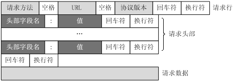

### (1)讲讲网络OSI七层模型，TCP/IP和HTTP分别位于哪一层

### (2)常见HTTP状态码有哪些
##### 2xx 开头（请求成功）
200 OK：客户端发送给服务器的请求被正常处理并返回

##### 3xx 开头（重定向）
301 Moved Permanently：永久重定向，请求的网页已永久移动到新位置。 服务器返回此响应时，会自动将请求者转到新位置
302 Moved Permanently：临时重定向，请求的网页已临时移动到新位置。服务器目前从不同位置的网页响应请求，但请求者应继续使用原有位置来进行以后的请求
304 Not Modified：未修改，自从上次请求后，请求的网页未修改过。服务器返回此响应时，不会返回网页内容

##### 4xx 开头（客户端错误）
400 Bad Request：错误请求，服务器不理解请求的语法，常见于客户端传参错误
401 Unauthorized：未授权，表示发送的请求需要有通过 HTTP 认证的认证信息，常见于客户端未登录
403 Forbidden：禁止，服务器拒绝请求，常见于客户端权限不足
404 Not Found：未找到，服务器找不到对应资源

##### 5xx 开头（服务端错误）
500 Inter Server Error：服务器内部错误，服务器遇到错误，无法完成请求
501 Not Implemented：尚未实施，服务器不具备完成请求的功能
502 Bad Gateway：作为网关或者代理工作的服务器尝试执行请求时，从上游服务器接收到无效的响应。
503 service unavailable：服务不可用，服务器目前无法使用（处于超载或停机维护状态）。通常是暂时状态。

### (3)GET请求和POST请求有何区别
+ 标准答案：
1. GET请求参数放在URL上，POST请求参数放在请求体里
2. GET请求参数长度有限制，POST请求参数长度可以非常大
3. POST请求相较于GET请求安全一点点，因为GET请求的参数在URL上，且有历史记录
4. GET请求能缓存，POST不能
+ 更进一步：
+ 其实HTTP协议并没有要求GET/POST请求参数必须放在URL上或请求体里，也没有规定GET请求的长度，目前对URL的长度限制，是各家浏览器设置的限制。GET和POST的根本区别在于：GET请求是幂等性的，而POST请求不是
+ 由于GET请求是幂等的，在网络不好的环境中，GET请求可能会重复尝试，造成重复操作数据的风险，因此，GET请求用于无副作用的操作(如搜索)，新增/删除等操作适合用POST

### (4)HTTP的请求报文由哪几部分组成
+ 一个HTTP请求报文由请求行（request line）、请求头（header）、空行和请求数据4个部分组成

### (5)HTTP常见请求/响应头及其含义
##### 通用头（请求头和响应头都有的首部）

##### 请求头

##### 响应头

##### 实体头（针对请求报文和响应报文的实体部分使用首部）

### (6)HTTP/1.0和HTTP/1.1有什么区别
1. 长连接： HTTP/1.1支持长连接和请求的流水线，在一个TCP连接上可以传送多个HTTP请求，避免了因为多次建立TCP连接的时间消耗和延时
2. 缓存处理： HTTP/1.1引入Entity tag，If-Unmodified-Since, If-Match, If-None-Match等新的请求头来控制缓存，详见浏览器缓存小节
3. 带宽优化及网络连接的使用： HTTP1.1则在请求头引入了range头域，支持断点续传功能
4. Host头处理： 在HTTP/1.0中认为每台服务器都有唯一的IP地址，但随着虚拟主机技术的发展，多个主机共享一个IP地址愈发普遍，HTTP1.1的请求消息和响应消息都应支持Host头域，且请求消息中如果没有Host头域会400错误

### (7) 介绍一下HTTP/2.0新特性
1. 多路复用： 即多个请求都通过一个TCP连接并发地完成
2. 服务端推送： 服务端能够主动把资源推送给客户端
3. 新的二进制格式： HTTP/2采用二进制格式传输数据，相比于HTTP/1.1的文本格式，二进制格式具有更好的解析性和拓展性
4. header压缩： HTTP/2压缩消息头，减少了传输数据的大小

### (8)说说HTTP/2.0多路复用基本原理以及解决的问题
+ HTTP/2解决的问题，就是HTTP/1.1存在的问题：
1. TCP慢启动： TCP连接建立后，会经历一个先慢后快的发送过程，就像汽车启动一般，如果我们的网页文件(HTML/JS/CSS/icon)都经过一次慢启动，对性能是不小的损耗。另外慢启动是TCP为了减少网络拥塞的一种策略，我们是没有办法改变的。
2. 多条TCP连接竞争带宽： 如果同时建立多条TCP连接，当带宽不足时就会竞争带宽，影响关键资源的下载。
3. HTTP/1.1队头阻塞： 尽管HTTP/1.1长链接可以通过一个TCP连接传输多个请求，但同一时刻只能处理一个请求，当前请求未结束前，其他请求只能处于阻塞状态。

### (9)
### (10)
### (11)